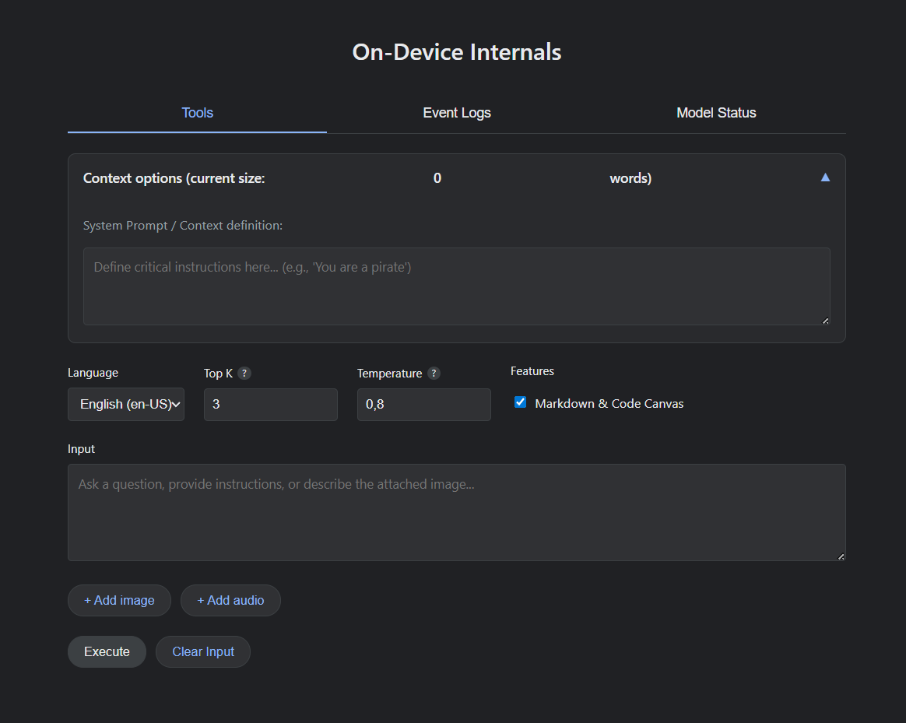

# **Gemini Nano Web Internals**

**Gemini Nano Web Internals** is an advanced local debugging and experimentation dashboard for Chrome's built-in window.ai.languageModel (Prompt API).

Built as a lightweight, vanilla front-end alternative to the native `chrome://on-device-internals` page, this tool provides developers with granular control over session creation, VRAM management, system prompt injection, and stream parsing while operating 100% locally via WebGPU and WASM.

## **Hardware Requirements**

Since Gemini Nano (v3Nano) runs entirely on-device, your system must meet specific hardware criteria to handle the model weights and token generation smoothly:

* **GPU:** DirectX 12 / Vulkan / Metal compatible GPU (WebGPU support required).
    * *Minimum:* NVIDIA GTX 1050, AMD Radeon RX 460, or modern Integrated Graphics (e.g., Intel Iris Xe, Apple M1).
* **VRAM:** 4GB minimum allocated Video RAM.
* **System RAM:** 8GB minimum (16GB highly recommended).
* **Storage:** \~4GB of free disk space (model weights are downloaded via Chrome Components).

## **Technical Features & API Implementations**

This tool addresses several inconsistencies and limitations currently present in the W3C Web Incubator experimental Prompt API:

* **Chrome 150+ Language Bypass & Universal Translation:**  
  Recent Chrome builds strictly validate the outputLanguage flag and usually only accept English, Spanish, or Japanese. This tool cleverly bypasses this WebIDL validation\! It spoofs the initial session as en-US but uses prompt engineering at the end of the payload to force the output into your preferred language. Supports 13+ languages including Korean, Russian, Arabic, and Hindi.
* **"Hammer Method" System Prompt Injection:**  
  Native systemPrompt support in the session options object is currently unstable and frequently ignored by the Nano model. This tool falls back to a deterministic injection method, aggressively prepending \[CRITICAL INSTRUCTION: \<context\>\] to the user payload to force attention mechanism compliance.
* **Real-time Stream Parsing & Code Canvas:**  
  Implements dynamic chunk accumulation mapped to marked.js for markdown rendering, coupled with highlight.js for syntax highlighting, effectively turning the output stream into a developer-friendly Code Canvas with one-click copy buttons.
* **Multimodal Payload Structure:**  
  Includes boilerplate implementation for early multimodal testing, formatting payloads as \[{ role: 'user', content: \[{ type: 'text', value: text }, { type: 'image', value: file }\] }\]. Supports both Image and Audio attachments (Audio soon Chrome 150-151).
* **Native Text-To-Speech (TTS) Integration:**  
  Leverages the browser's native window.speechSynthesis API for an 'Auto-Read Voice' feature. The TTS engine strips away markdown artifacts before reading and automatically adapts its pronunciation to your selected BCP-47 language tag—no external cloud APIs required\!
* **Dev-Friendly Key Bindings:**  
  Optimized input area where Enter instantly triggers the execution payload, while Shift \+ Enter or Ctrl/Cmd \+ Enter safely insert line breaks.
* **VRAM Management & Force Kill (AbortController):**  
  Streaming local LLMs can cause UI freezes or memory leaks if unmanaged. This implementation binds an AbortController to the promptStreaming() method. Triggering the "Stop" action not only aborts the signal but explicitly calls session.destroy() to flush the VRAM and forcefully terminate the worker thread.

## **Prerequisites & Chrome Setup**

Before you jump in, you'll need to tweak a few Chromium flags to expose the window.ai.languageModel API. Make sure you are using Chrome Dev or Canary (v148+ is highly recommended).

1. Open chrome://flags and configure the following:
    * **Prompt API for Gemini Nano**: Set to Enabled.
2. Relaunch the browser.

## **Usage**

No build step or local Node.js server is required.

1. Clone the repository.
2. Open on-device-internals.html directly in Chrome.
3. Check the **Model Status** tab to ensure the hardware capability check returns a readily status.
4. Tweak your Top K, Temperature, and System Prompt in the UI, and hit Execute to start chatting with the local model\!

## **Debugging**

* **window.ai.languageModel is not available**: The Prompt API flag is not active, or you are running an unsupported browser version.
* **Out of Memory (OOM) / Page Crash**: The session failed to allocate enough VRAM. Close other heavy WebGL/WebGPU tabs and restart the browser. Use the "Event Logs" tab to monitor session lifecycle events.

## **License**

MIT License. Open for community contributions and debugging experimental Web AI features.

Copyright (c) 2001-2026 JServlet.com [Franck ANDRIANO.](http://jservlet.com)
